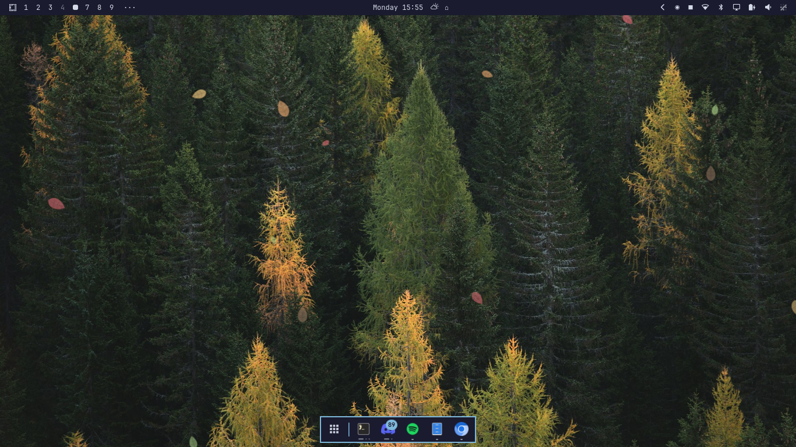
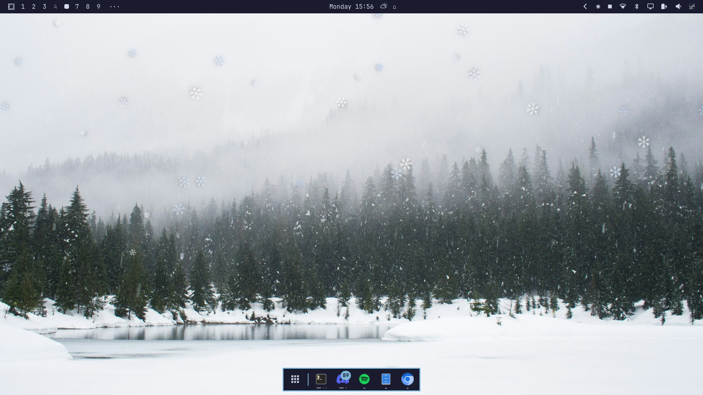

# Seasons Theme for Omarchy Quattro

A beautiful animated theme that represents the changing seasons of the year with particle effects that change based on the current month.





https://github.com/user-attachments/assets/screenrecording-2026-08-24_15-59-19.mp4

## Features

- **12 photorealistic wallpapers** - One for each month, sourced from Unsplash
- **Animated particle overlay** - QML-based particle system that renders seasonal effects:
  - **Winter (Dec-Feb)**: Gentle falling snowflakes with wobble and rotation
  - **Spring (Mar-May)**: Rain showers with realistic falling angles
  - **Summer (Jun-Aug)**: Floating dandelion seeds drifting upward
  - **Autumn (Sep-Nov)**: Colorful falling leaves tumbling in the wind
- **Automatic month detection** - Particles change based on the current month
- **Dark seasonal color palette** - Complementary UI colors that work year-round

## Installation

```bash
# Clone the repo
git clone https://github.com/Boboloboramba/omarchy-seasons.git
cd omarchy-seasons

# Run the installer
chmod +x install.sh
./install.sh

# Apply the theme
omarchy theme set seasons
```

## Manual Wallpaper Change

To manually set a specific month's wallpaper:

```bash
# Set to a specific month
omarchy theme bg set ~/.config/omarchy/themes/seasons/backgrounds/01-january-winter.jpg
```

## Testing & Season Cycling

Press `SUPER+ALT+S` to cycle through seasons (changes both particles and wallpaper).

Terminal commands:

```bash
./season-switch.sh cycle      # Next season
./season-switch.sh winter     # Specific season
./season-switch.sh reset      # Back to automatic
omarchy-shell seasons current # Show current season
```

## How It Works

The theme consists of two components:

1. **Theme** (`~/.config/omarchy/themes/seasons/`) - Standard Omarchy theme with colors, icons, and wallpapers
2. **Plugin** (`~/.config/omarchy/plugins/local.seasons/`) - QML service that renders transparent particle overlays on the desktop

The plugin uses a `ListModel` + `Repeater` pattern (similar to the Omarchy Breakout game) with a 16ms timer for smooth 60fps particle animation.

## Customization

### Particle Density

Edit `Seasons.qml` to adjust the spawn interval in the `spawnTimer`:

```qml
Timer {
  id: spawnTimer
  interval: {
    switch (root.season) {
      case "winter": return 400  // Lower = more snowflakes
      case "spring": return 80   // Lower = more rain
      case "summer": return 600  // Lower = more dandelion seeds
      case "autumn": return 500  // Lower = more leaves
    }
  }
}
```

### Particle Colors

Edit the color arrays in `Seasons.qml`:

```qml
property var snowColors: ["#ffffff", "#e8f0ff", "#d4e8ff"]
property var rainColors: ["#7eb8da", "#6ba8cc", "#94ccf0"]
property var leafColors: ["#d19a66", "#e06c75", "#e5c07b"]
property var dandelionColors: ["#ffffff", "#ffd700", "#ffec8b"]
```

## Requirements

- Omarchy Quattro (v4+)
- Quickshell (included with Omarchy)

## License

MIT

## Credits

- Wallpapers sourced from [Unsplash](https://unsplash.com)
- Particle system inspired by the Omarchy Breakout plugin
- Built for the Omarchy Quattro desktop environment
